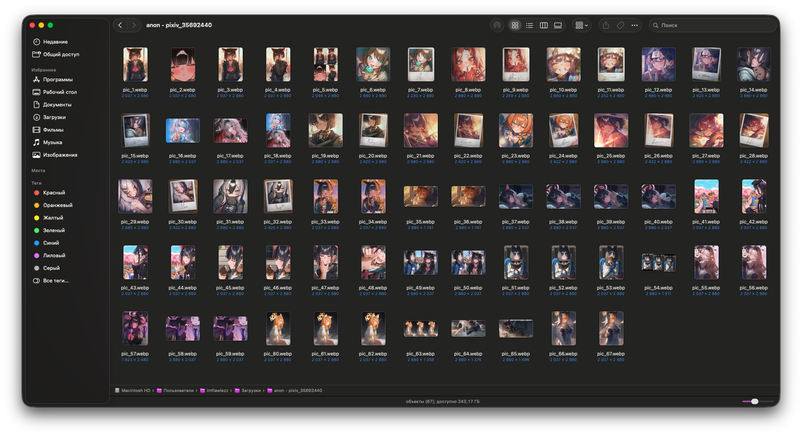
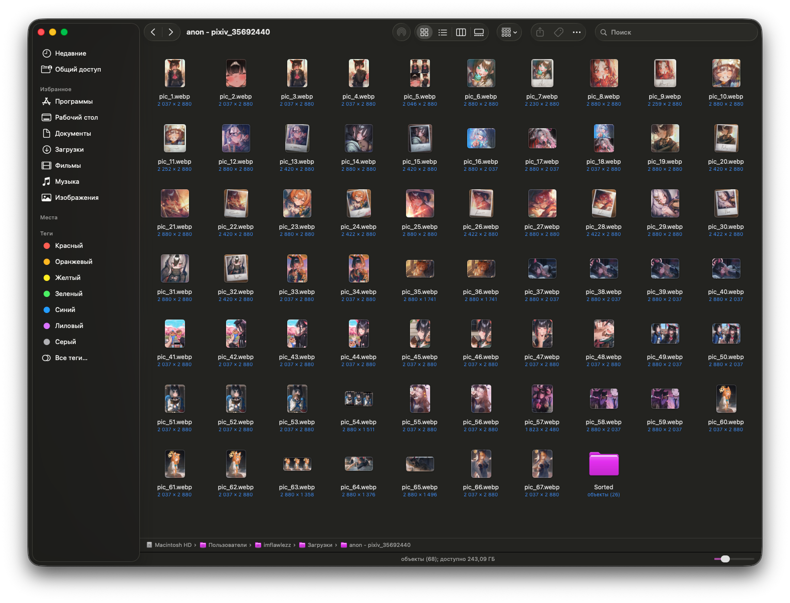
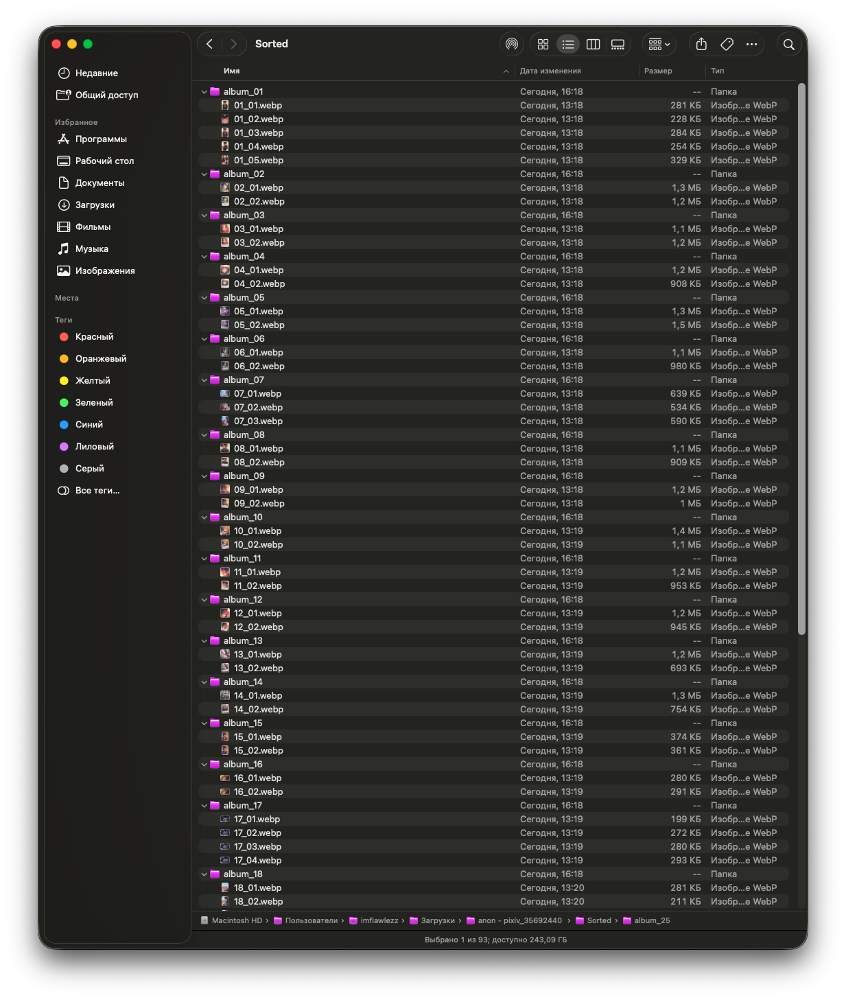
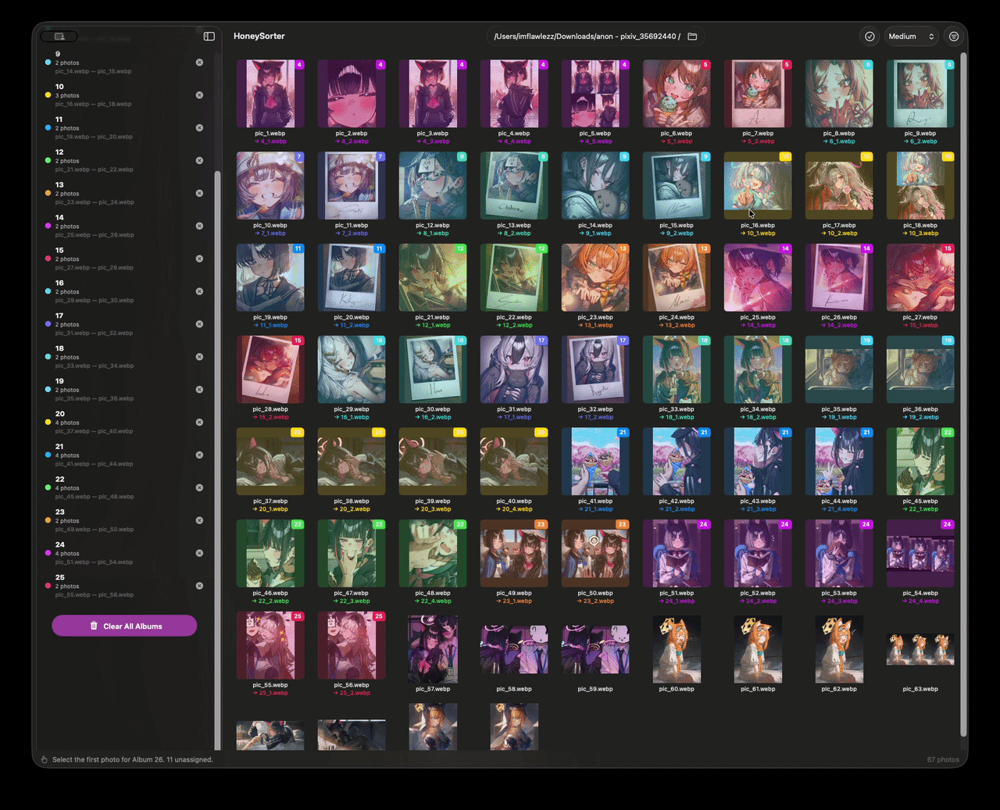
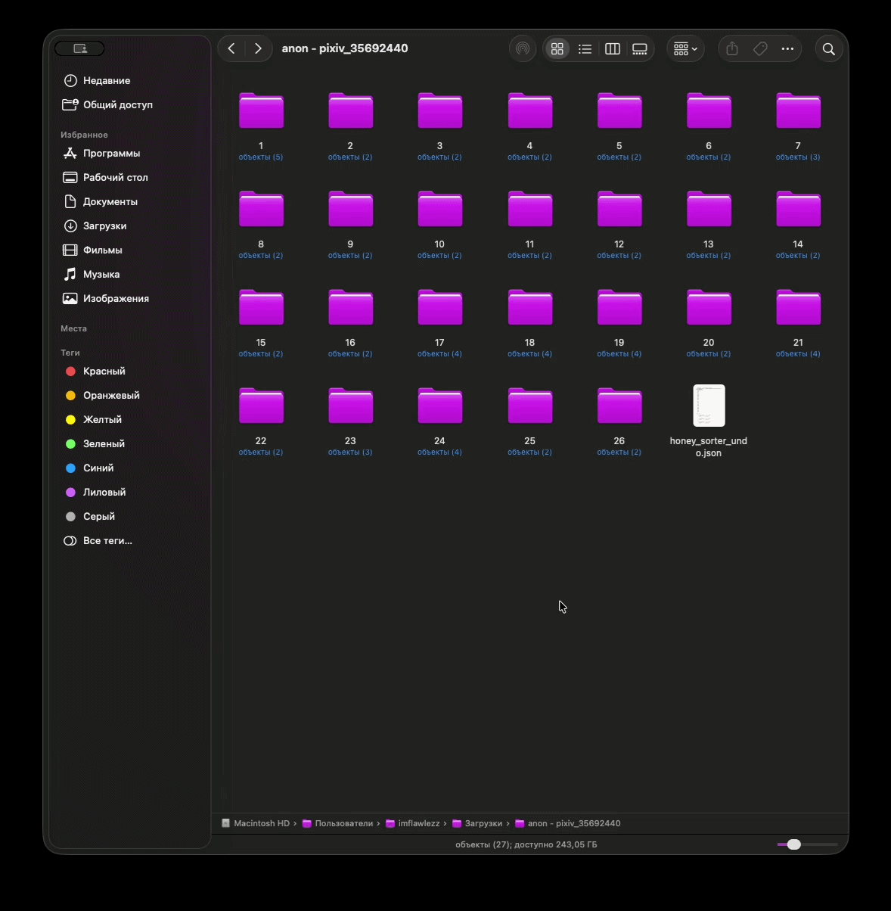
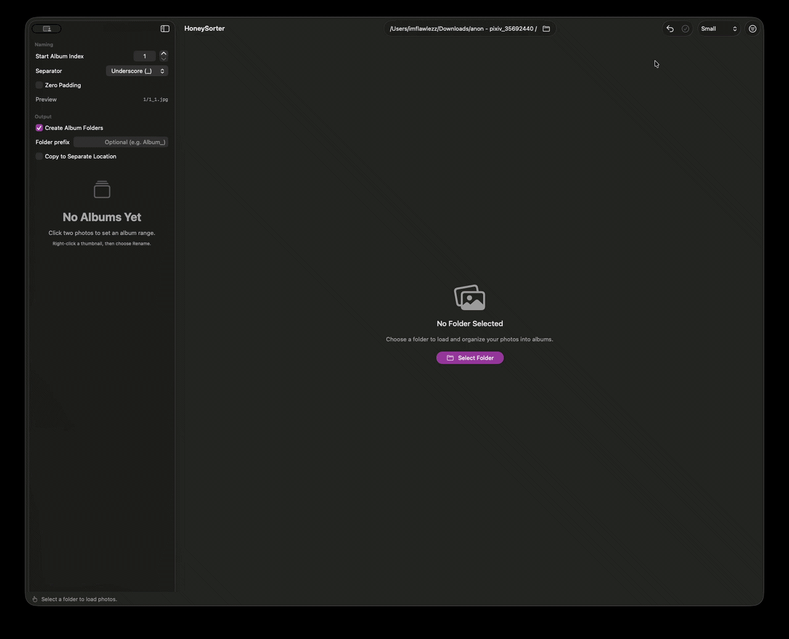

# HoneySorter 🍯

A small macOS app for turning a messy pile of images into tidy, numbered albums — with a batch rename baked in.

## What's it for?

You've got a folder of images. Maybe it's an art archive, a trip, a photo dump. The files are already in the right order — they're just *all over the place*, with no grouping. HoneySorter lets you draw ranges over that list, group them into albums, and rename everything in one shot.

Output looks like `<albumIndex>_<photoIndex>.<extension>`. Clean, predictable, sortable.

If you don't want to touch the originals, copy mode will duplicate everything to a separate location instead.

## How it works

1. **Load a folder** — the app scans for common image formats and lays them out in a grid, sorted by filename.
2. **Define albums** — click a start image, click an end image. Everything between becomes an album. Repeat until you're done.
3. **Configure naming** — separator, zero-padding, starting index, optional subfolders per album. There's a live preview in the sidebar.
4. **Apply** — hit **Rename All** or **Copy All**. That's it.

A revert manifest gets written to disk after each batch run, so you can undo if something went sideways.

## Features

- **Album ranges** — continuous ranges only; numbering updates automatically if you remove one or change the start index
- **Batch rename** — `albumIndex + separator + photoIndex + ext`, live preview included
- **Subfolders per album** — optional, with custom prefix support (`album_1`, `MyTrip_1`, whatever)
- **Copy mode** — non-destructive; defaults to a `Sorted` subfolder if you don't pick a destination
- **Single-file rename** — right-click any thumbnail
- **Undo** — **Revert** reads the manifest and walks filenames back
- **Grid filters** — hide already-assigned photos to keep focus on what's left
- **Folder monitoring** — picks up changes in the underlying directory

## Demo

### Starting point

Flat folder, files in order, no structure yet.



### Picking ranges

Click first image, click last image — everything in between becomes an album. Keep going until the pile's sorted.


### Copy settings

Don't want to touch the originals? Enable **Copy to Separate Location**, pick a destination (or just use the default `Sorted` folder), then hit **Copy All**.


### Output

A `Sorted` folder appears next to your originals, with subfolders per album and renamed files inside.




### Tweaking indexes

Need numbering to start at 10? Want zero-padding? Remove a bad range? All live in the sidebar, all update the preview instantly.


### Hiding assigned photos

Filter the grid to show only unassigned images — useful when the collection is large and you're partway through.



### Rename

Each thumbnail shows the current name and the new one underneath. When the preview looks right, **Rename All** makes it real.


### Undo

After a batch run, a `honey_sorter_undo.json` file lands in the source folder. **Revert** reads it and puts filenames back.




## Credits

Screenshots and recordings in **Demo** feature artwork by **anon** — [pixiv](https://www.pixiv.net/en/users/35692440/artworks).

## Requirements

- macOS 14+, tested on macOS 26
- Sandboxed — needs user-granted read/write access to your folders

## Building

There's a pre-built `HoneySorter.app` in the repo root — just double-click it. If macOS blocks it, right-click → Open.

To build from source:

```bash
xcodebuild -scheme HoneySorter -configuration Debug build
```

Or open `HoneySorter.xcodeproj` in Xcode and run the scheme directly.